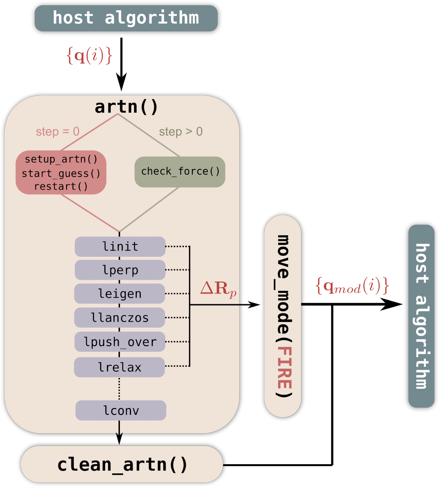

############
Introduction
############

This is a working repository of the current version of the plugin-ARTn; currently it can be used with Quantum ESPRESSO and LAMMPS.
This code has been developed in collaboration by Matic Poberznik, Miha Gunde, Nicolas Salles and Antoine Jay.

.. The repository is developed on `GitLab`_.
The full documentation is available at: `link`_.
Please post your issue(s) on `GitLab`_.

.. _GitLab: https://gitlab.com/mammasmias/artn-plugin
.. _link: https://mammasmias.gitlab.io/artn-plugin/

The algorithm `ARTn`_ allows the exploration of the energetic landscape of an atomic configuration, to find the saddle point (transition state), and the associated energy minima. 

.. _ARTn: https://normandmousseau.com/ART-nouveau.html

Contains:
=========

- ``examples/``: Contains many examples, from molecules to surfaces;
- ``Files_LAMMPS/``: Contains the lammps fix, for the LAMMPS/ARTn interface;
- ``Files_QE/``: Contains the file `plugin_ext_forces.f90`, for the QE/ARTn interface;
- ``README.md``: This file;
- ``src/``: ARTn plugin subroutines;
- ``Makefile``: Compilation commands, uses the environment variables defined in `environment_variables`;
- ``environment_variables``: custom file defining:
	- compilers ``F90``, ``CXX``/``CC``;
	- the paths to ARTn (current directory), BLAS and FORTRAN libraries, and chosen engine(s) QE/LAMMPS;
	- ``PARA_PREFIX`` prefix for launching examples via provided run scripts.

Interface with engine
=====================

Two interfaces has been developed for the moment:

- **Quantum ESPRESSO**: To use it read the :ref:`installation`.
- **LAMMPS**. Two versions exist depending on the version of LAMMPS.
    #. One using the class `Plugin`_ of LAMMPS, for this version please read :ref:`install_lammps_new`
    #. The second one does not use the class plugin of LAMMPS because this class exist only since 2022. If you use a version older than 2022 please read the :ref:`install_lammps_old`

.. _Plugin: https://docs.lammps.org/plugin.html

Examples
========

The list of :ref:`examples` using both interfaces.

Using ARTn
==========

The installation depend of the Energy/Forces engine to want to use, for more information please read documentation on the :ref:`installation`
To customise the input of ARTn please read the :ref:`input`.
The different output files are explained in section :ref:`output`.

CMake
-----

Clone artn-plugin project.

.. code::

    git clone https://gitlab.com/mammasmias/artn-plugin.git
    cd artn-plugin && mkdir build && cd build

To build artn-plugin along with lammps.

.. code::

	cmake ../ -DWITH_LAMMPS=yes
	cmake --build . --target lmp -j16

To build artn-plugin along with qe.

.. code::

	cmake ../ -DWITH_QE=yes
	cmake --build . --target pw -j16

To build artn-plugin only.

.. code::

	cmake ../
	cmake --build .

Issues, bugs, requests
======================

Use the `issue`_ tracker to report the bugs.

.. _issue: https://gitlab.com/mammasmias/artn-plugin/-/issues

License
========

`Terms of use`_. 

.. _Terms of use: ../../TERMS_OF_USE

Citation
========

Please cite the article of this project:

`pARTn: a plugin implementation of the Activation Relaxation Technique nouveau hijacking a minimisation algorithm`, **Computer Physic Comunication** XXX,XXX (2023), M. Poberznik, M. Gunde, N. Salles, A. Jay, A. Hemeryck, N. Richard, N. Mousseau and L. Martin-Samos

